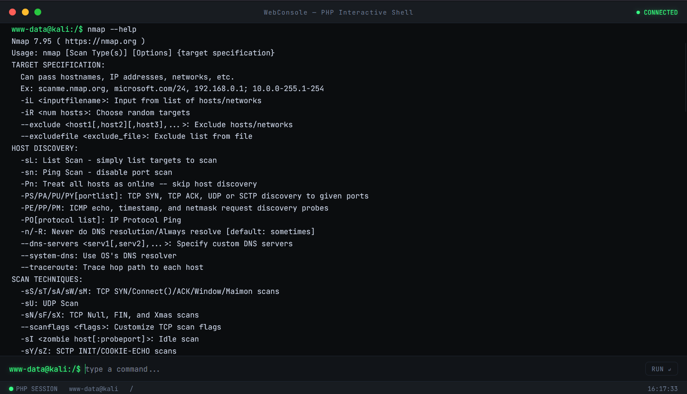
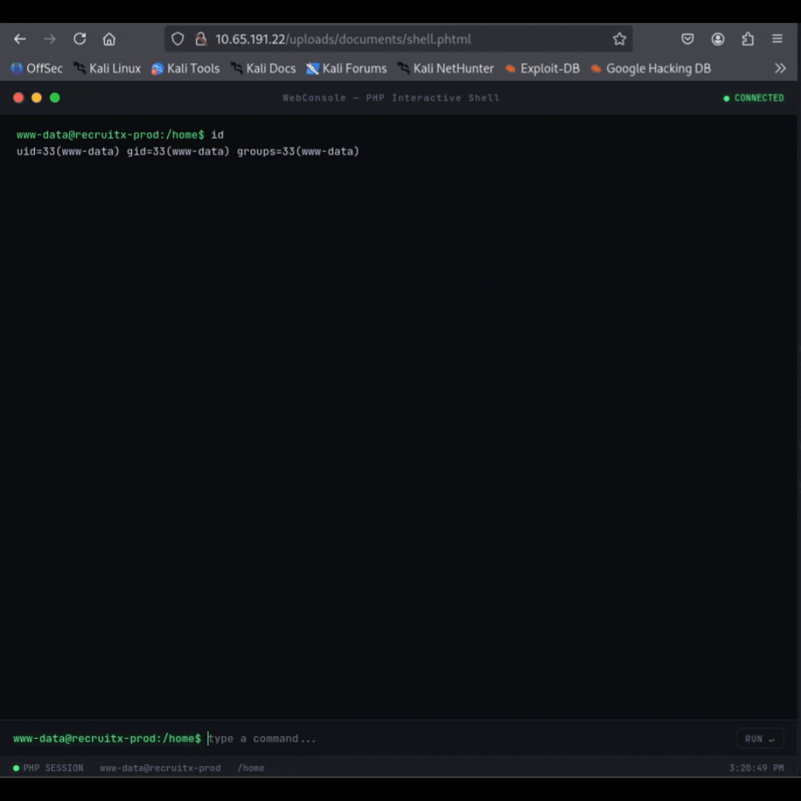

# WebShellConsole
A lightweight web terminal emulator built with PHP and vanilla JavaScript, providing interactive shell access through a modern terminal-like interface.

<p align="center">
  
</p>

<h1 align="center">NeonShell - WebShellConsole</h1>

<p align="center">
  
  
  
  
</p>

<p align="center">
  <b>Cyberpunk-inspired web terminal written in PHP.</b><br>
  Interactive shell access directly from the browser with AJAX-powered command execution.
</p>

---

## Preview

<p align="center">
  
</p>

## Demo

<p align="center">
<table>
<tr>
<td align="center">


</td>

<td align="center">



</td>
</tr>
</table>
</p>


# Features

- Interactive terminal interface
- Real-time command execution
- AJAX-based backend communication
- Session-based working directory persistence
- Command history navigation
- TAB autocomplete support
- Built-in terminal commands
- Cyberpunk/CRT styled UI
- Responsive layout
- Linux-like shell experience
- Pure PHP + Vanilla JavaScript

---

# Built-in Commands

| Command | Description |
|---|---|
| `cd` | Change directory |
| `clear` | Clear terminal |
| `cls` | Windows-style clear |
| `exit` | Destroy current session |

---

# Keyboard Shortcuts

| Shortcut | Action |
|---|---|
| `ENTER` | Execute command |
| `↑ / ↓` | Navigate command history |
| `TAB` | Autocomplete |
| `CTRL + L` | Clear terminal |

---

# Requirements

## Server

- PHP 7.4+
- Apache / Nginx / PHP Built-in Server
- Linux recommended

---

## Required PHP Functions

The following PHP functions must NOT be disabled:

```ini
proc_open
shell_exec
session_start
chdir
getcwd
```

Check disabled functions:

```bash
php -i | grep disable_functions
```

---

# Installation

## Clone repository

```bash
git clone https://github.com/brunoriquelme/WebShellConsole
cd WebShellConsole
```

---

## Move file to web directory

### Apache

```bash
sudo cp WebShellConsole.php /var/www/html/index.php
```

---

## Set permissions

```bash
sudo chown www-data:www-data /var/www/html/index.php
```

---

# Running

## Using PHP built-in server

```bash
php -S 0.0.0.0:8000
```

Access:

```text
http://localhost:8000
```

---

## Using Apache

```bash
sudo systemctl start apache2
```

Access:

```text
http://SERVER-IP/
```

---

# Usage

Execute commands directly from the browser:

```bash
ls -la
pwd
whoami
uname -a
```

Navigate directories:

```bash
cd /var/www
cd ..
cd ~
```

Clear terminal:

```bash
clear
```

---

# Technical Overview

## Backend

The backend is written in PHP and uses:

- `proc_open()` for command execution
- `$_SESSION` for directory persistence
- JSON-based communication
- Base64 command transport
- stdout/stderr handling

---

## Frontend

The frontend uses:

- Vanilla JavaScript
- Fetch API
- Dynamic DOM manipulation
- CRT-inspired CSS styling
- Responsive terminal UI

---

# Compatibility

Tested on:

- PHP 7.4
- PHP 8.x
- Debian
- Ubuntu
- Kali Linux
- Apache2

---

# Security Warning

## IMPORTANT

This project executes system commands directly on the host machine.

DO NOT expose this application publicly without:

- Authentication
- IP restrictions
- VPN
- Reverse proxy protections
- Sandboxing
- Containers
- Firewall rules

---

# Disclaimer

This project is provided strictly for:

- Educational purposes
- Authorized administration
- Local environments
- Security research
- Laboratory usage

The author assumes NO responsibility for:

- Misuse
- Illegal activities
- Unauthorized access
- System compromise
- Data loss
- Damages caused by this software

Use at your own risk.

---

# Roadmap

- [ ] Authentication system
- [ ] Multi-user support
- [ ] PTY support
- [ ] File upload/download
- [ ] Docker support
- [ ] WebSocket terminal
- [ ] Themes
- [ ] Read-only mode
- [ ] Command logging

---

# License

MIT License

Copyright (c) 2026

Permission is hereby granted, free of charge, to any person obtaining a copy
of this software and associated documentation files (the "Software"), to deal
in the Software without restriction.

THE SOFTWARE IS PROVIDED "AS IS", WITHOUT WARRANTY OF ANY KIND.

---

# Author

Developed for:

- Linux studies
- Web terminal experimentation
- PHP learning
- Security research
- Remote administration interfaces

---

# Star History

If you like this project, consider giving it a ⭐ on GitHub.
